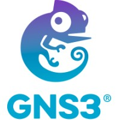

# Mise en place d’une plateforme de détection d’intrusions
## Introduction
Ce projet consiste à créer une plateforme de détection des intrusions. Nous allons préparer un lab local pour répondre aux besoins de ce projet. GNS3 est un bon outil à utiliser pour la création de ce lab.



Dans ce projet, le travail est divisé en trois parties :

- Étude et implémentation: une étude des attaques sur chaque couche (transport, internet, liaison de données). Cette étape inclut également l'implémentation de chaque attaque.
- Snort et Suricata: cette étape a pour objectif de faire une étude approfondie de Snort et Suricata, et d'analyser les différences entre les deux.
- Implémentation des attaques : la dernière étape consiste à implémenter les attaques et à les détecter à l'aide de Snort et Suricata.
## Etude et implémentation 
Étude et implémentation :
Pour la couche transport, nous étudierons trois attaques :

- Attaque SYN Flood : avec hping3
- Attaque UDP Flood : avec hping3
- Attaque TCP Reset : avec hping3 ou en utilisant le fichier tcp_reset.py

Pour la couche internet :

- Spoofing d'adresse IP : en utilisant nmap avec les options -S ou -D
- Attaques de routage : avec Loki ([Lien GitHub](https://github.com/Raizo62/Loki_on_Kali))
- Attaques d'injection de fausses informations de routage : avec injection_attack.py

Pour la couche d'accès réseau :

- ARP Spoofing : avec ettercap 
- Attaque de déauthentification (ou déconnexion) : avec airmon-ng
- MAC Spoofing : avec macchanger

## Snort & Suricata 
### Snort
Les etapes pour installer Snort :
#### Étape 1 : Mettre à jour votre système 

    ```
    sudo apt update
    sudo apt upgrade 
    ```

#### Étape 2 : Installer les dépendances nécessaires

    ```bash
    sudo apt install -y build-essential libpcap-dev libpcre3-dev libdumbnet-dev bison flex zlib1g-dev
    ```

#### Étape 3 : Télécharger et installer DAQ
    ```bash
    # Téléchargez DAQ
    wget https://www.snort.org/downloads/snort/daq-2.0.7.tar.gz

    # Extraire les fichiers
    tar -xvzf daq-2.0.7.tar.gz

    # Accédez au dossier DAQ
    cd daq-2.0.7

    # Compiler et installer DAQ
    ./configure
    make
    sudo make install
    ```
#### Étape 4 : Télécharger et installer Snort
    ```bash
    # Téléchargez Snort
    wget https://www.snort.org/downloads/snort/snort-2.9.20.tar.gz

    # Extraire les fichiers
    tar -xvzf snort-2.9.20.tar.gz

    # Accédez au dossier Snort
    cd snort-2.9.20

    # Compiler et installer Snort
    ./configure --enable-sourcefire
    make
    sudo make install
    ```
#### Étape 5 : Configurer les répertoires
    ```bash
    sudo mkdir /etc/snort
    sudo mkdir /etc/snort/rules
    sudo mkdir /var/log/snort
    sudo mkdir /usr/local/lib/snort_dynamicrules
    ```
#### Étape 6 : Télécharger les règles de Snort
    ```bash
    # Télécharger les règles via snort.org
    ```
#### Étape 7 : Configurer Snort
    ```bash
    sudo cp etc/snort.conf /etc/snort/
    ```
    ```bash
    sudo nano /etc/snort/snort.conf
    ```
    ```bash
    var RULE_PATH /etc/snort/rules
    var SO_RULE_PATH /usr/local/lib/snort_dynamicrules
    ```
#### Étape 8 : Tester l'installation
    ```bash
    sudo snort -T -i eth0 -c /etc/snort/snort.conf
    ```
#### Étape 9 : Lancer Snort en mode écoute
    ```bash
    sudo snort -A console -q -c /etc/snort/snort.conf -i eth0
    ```